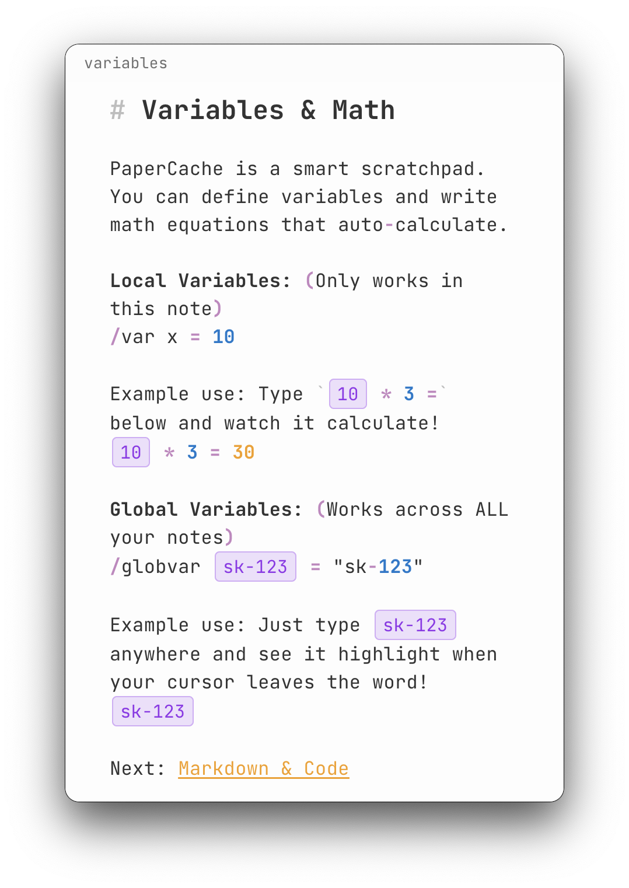
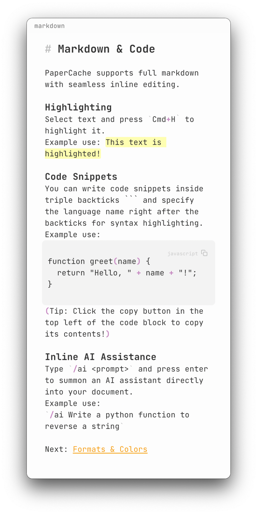
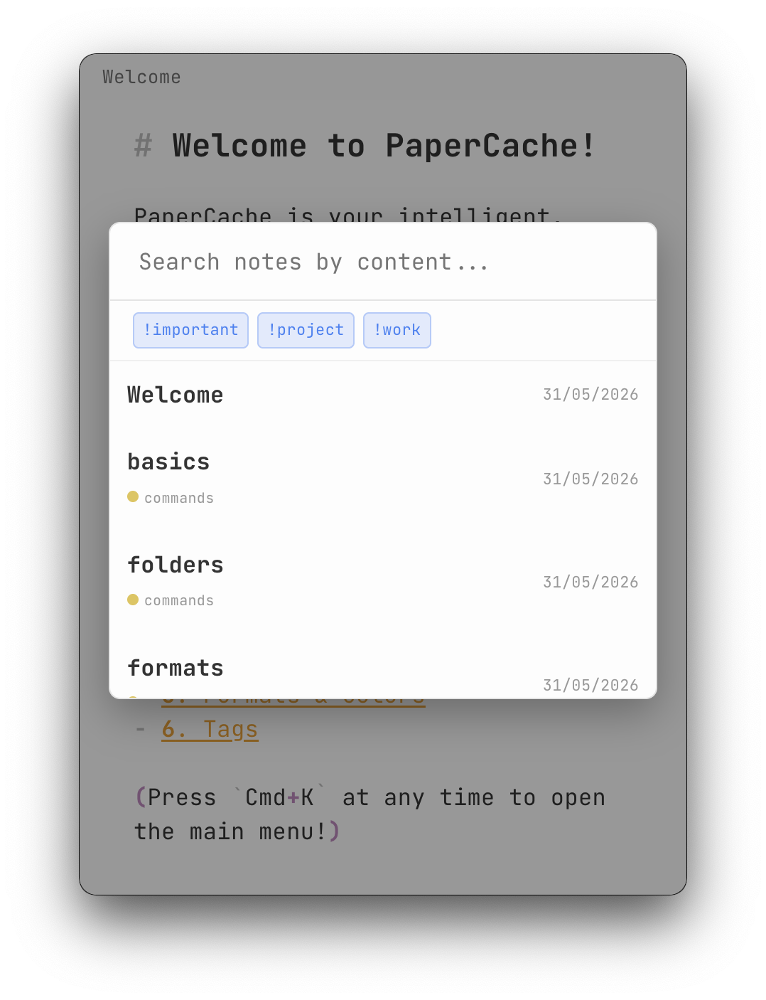
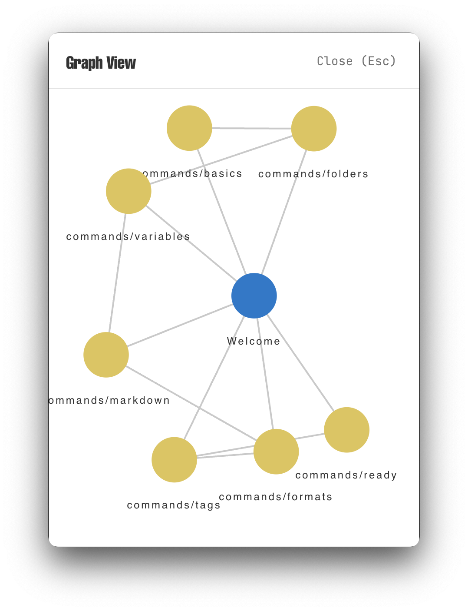

<div align="center">
  
  
  # PaperCache
  **A floating markdown scratchpad for developers and power users.**
</div>

Summon it with a hotkey. Jot. Dismiss. It stays out of your way until you need it.

---

## What makes it different

- **Lives in the background** — no dock icon, no window chrome. Press your hotkey, it appears on whatever screen your mouse is on. Click away, it vanishes.
- **Reactive math & variables** — define `/var x = 10`, write `x * 3 =`, get `30`. Change the variable, everything updates. Works across notes with `/globvar`.
- **Inline AI** — type `/ai <prompt>`, press enter, get the answer inserted directly into your note. No sidebar, no context switch.
- **Auto-highlights hex colors, dates, and times** — `#D97757` renders as a color pill. `2024-05-31` gets highlighted. Useful at a glance.
- **Tags & folders** — `!tagname` for tags, `/` in note titles for folders. Simple conventions, no UI overhead.
- **Graph view** — see how your notes connect (`Cmd+G`).

> **Deep Dive:** For a comprehensive list of every single feature in PaperCache, check out [features.md](features.md).

---

## Screenshots

<div align="center">
  
  
  <br><br>
  
  
</div>

---

## Install

**Homebrew (macOS):**

```bash
brew tap variablethe/tap
brew install --cask papercache
```

**Direct download:** grab the latest `.app` or `.exe` from [Releases](https://github.com/VariableThe/PaperCache/releases).

> If macOS blocks the app, run: `xattr -cr /Applications/PaperCache.app`

---

## Build from source

```bash
git clone https://github.com/VariableThe/PaperCache.git
cd PaperCache
npm install
npm run dev
```

Built with Electron, React, TypeScript, and Vite.

---

## Shortcuts

| Shortcut      | Action                                   |
| ------------- | ---------------------------------------- |
| `Cmd+Shift+C` | Toggle visibility (global, configurable) |
| `Cmd+Shift+N` | New note (global, configurable)          |
| `Cmd+Shift+S` | Open settings panel                      |
| `Cmd+N`       | New note (in-app)                        |
| `Cmd+K`       | Main action menu                         |
| `Cmd+P`       | Search notes                             |
| `Cmd+G`       | Graph view                               |
| `Cmd+H`       | Highlight selected text                  |
| `Cmd+E`       | Export note                              |
| `Cmd+Click`   | Follow internal link                     |
| `Cmd + / -`   | Zoom in / out                            |
| `Cmd + 0`     | Reset zoom                               |
| `Esc`         | Close menus or modals                    |

---

## AI setup

PaperCache uses your own OpenAI API key — no subscription, no middleman. Configure your key, model, and optionally a custom endpoint (works with local LLMs like Ollama) in Settings (`Cmd+K` → Settings).

---

## License

MIT License.
